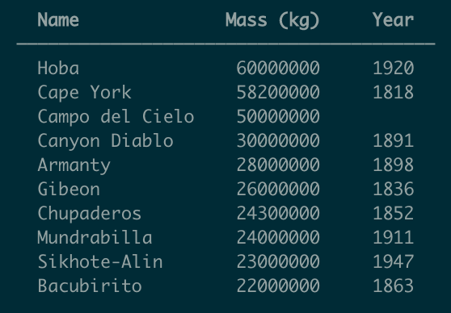
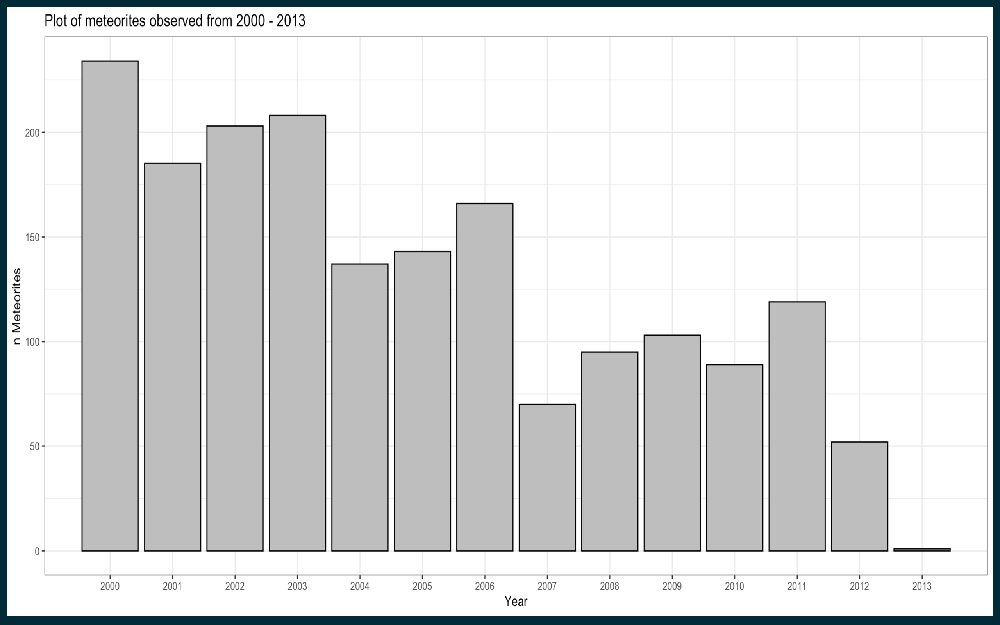
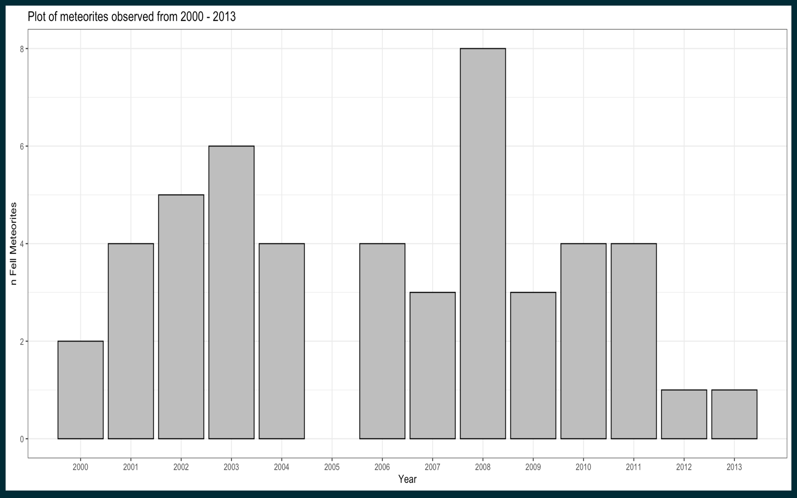
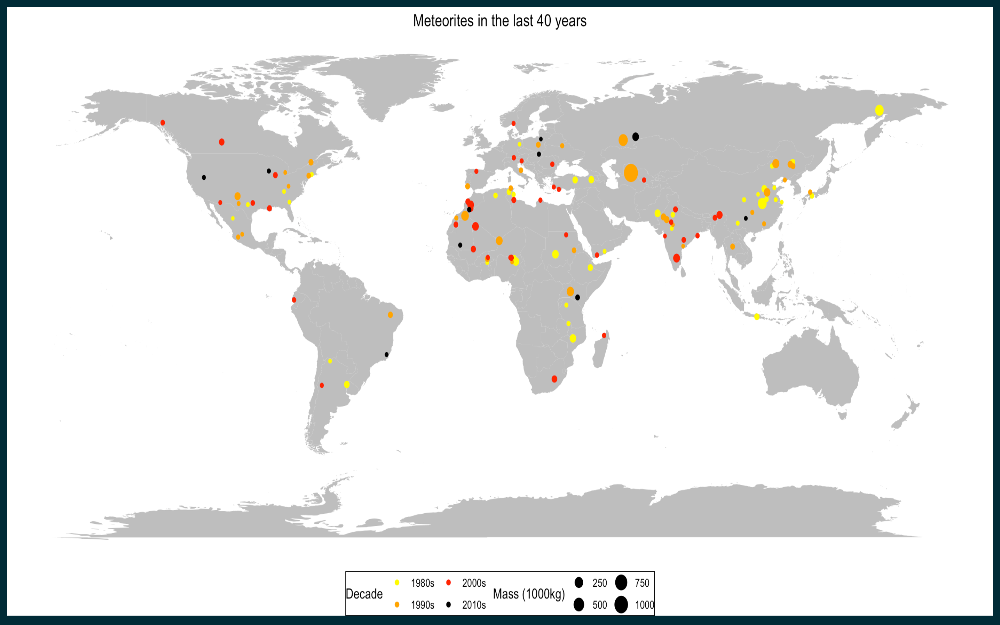

## Background and aims

This is a report using the open meteorites dataset from nasa. It is a subset of
6 columns from the https://www.kaggle.com/nasa/meteorite-landings data.

The purpose of this report is to investigate the data using the R language and
answer the following questions:

* What are the names and years of find for the largest ten meteorites?
* What is the mean average mass of meteorite in the dataset?
* What number of meteorites have been recorded in the 21st century?

Further investigation includes:

* What is the trend in the number of annual meteorites recorded?
* What is the trend in the number of annual meteorites observed falling, (as
opposed to those which are only found) ?
* Where have meteorites been observed falling in the past 40 years?
You may want to include information such as:

## How to run the project

The project was written in RStudio using the R language.

1. pull the raw data, cleaning script and notebook files and save them to the
same directory. (`raw_data.csv`, `data_cleaner_script.R`,`meteorite_report.Rmd`)
2. run the R notebook, install any missing necessary packages.

## Specific code elements:

The RMD notebook file includes code chunks that:

0. load the required libraries, the raw (dirty) data, and the R script used for
cleaning the data

1. find the names and years of the ten largest meteorites by selecting only the
relevant columns from the clean meteorites data and then taking a slice of the
ten largest masses

2. Find the average mass of "falling" meteorites by filtering out any meteorites
which were only "found" and then summarising the remaining meteorites and
calculating their mean average mass

2.1. Find the average mass of "found" meteorites by filtering for them,
summarising, and calculaating their mean average mass

3. find the number of meteorites that recorded in each since the year 2000 by
filtering out any which records not specified within the range, counting the
number of meteorites per year and then summarising into a table showing the
number of meteorites for each year

4. plot the number of meteorites against year

5. plot the number of falling meteorites against year

6. plot each recorded meteorite on a map of the world

7. plot only the large (greater than the mean average) meteorites observed
falling

8. calculate the median average mass of fallen meteorites

9. plot the meteorites observed falling within the past 100 years on a map of
the world

10. plot the meteorites observed falling within the past 40 years

## Results:

The results of the investigation are summarised below

### Largest Meteorites by mass

### Meteorites recorded over the period 2000 - 2012

The plot can then be filtered to see the trend with only the meteorites
observed falling, as opposed to those only found.

### Meteorite world map overlay

The final plot consists of meteorites observed falling in the past 40 years
overlayed onto the world map and distinguished by decade.

## Data Used:
meteorites data from nasa for years up to 2013
https://www.kaggle.com/nasa/meteorite-landings

## Librarys/packages used

| Library | Version |
| --------|---------|
|tidyverse|1.3.0|
|assertthat|0.2.1|
|assertr|2.7|
|ggplot2|3.3.2|
|maps|3.3.0|
